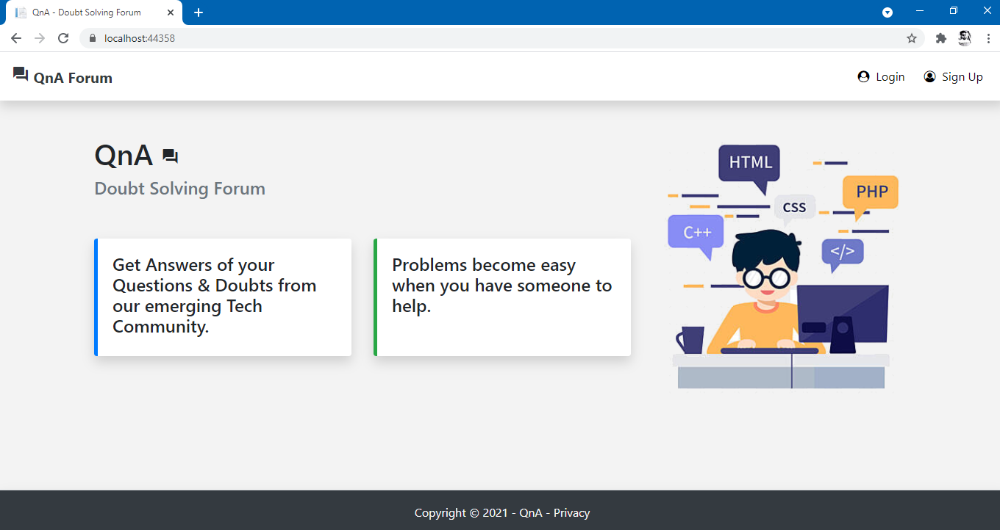

# DoubtSolvingForum
This is an online doubt solving forum web application for people related to CSE field. Users can post the Questions regarding their doubts, erros or issues and can get answers from other users of the system

## Main features of the application 
* Login & Signup
* Post the questions using markdown editor.
* Post answers to the questions posted by other users.
* Up-vote other's answer if it is useful.
* Down-vote other's answer if it is wrong or not useful.

## Technologies Used
1. Dotnet core  framework for full stack development.
2. SQL server database for storing data.
3. Bootstrap 4 for designing frontend.

## Screenshots of working application

<table>
  <tr>
    <td><td>
    <td><td>
  </tr>
  <tr>
    <td><td>
    <td><td>
  </tr>
  <tr>
    <td><td>
    <td><td>
  </tr>
  <tr>
    <td><td>
    <td><td>
  </tr>
</table>
